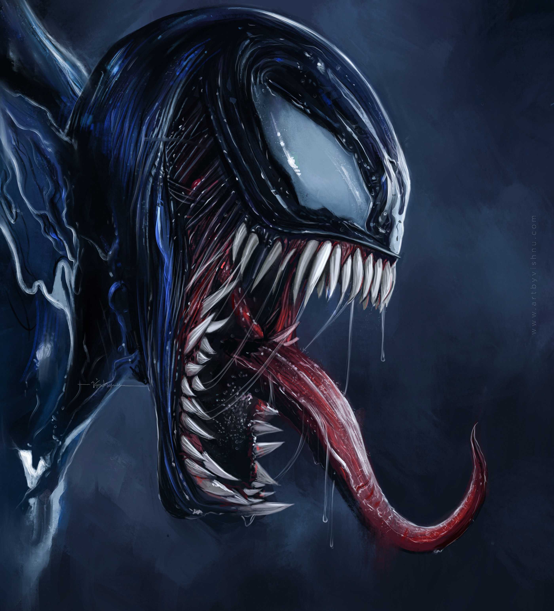
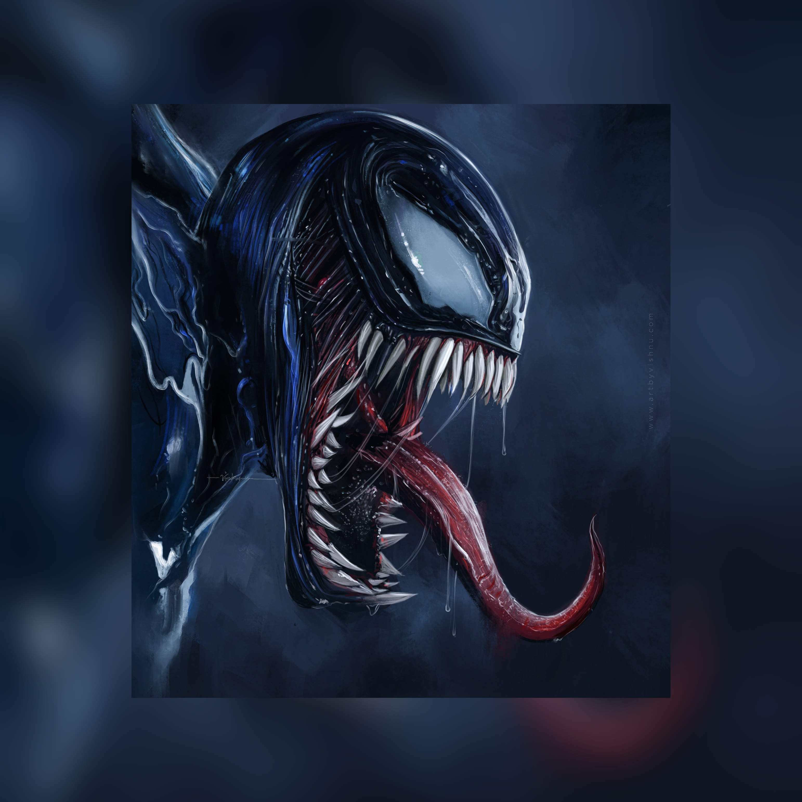

# rect2square

Converts rectangle image to a square image, without losing any data.

<div style="width: 100%;text-align: center;">
    <div title="patelka2211/rect2square on GitHub" style="display: flex;flex-direction: column;align-items: center;justify-content: space-around; max-width: 100vw; margin: auto; padding: 0.6vh;border: 1px solid #b9bbbe99; border-radius: 1.6vh;">
        
        <div style="margin: 5px auto;color: #58a6ff;">
            github.com /
            <code>
            <a href="https://github.com/patelka2211/rect2square" title="patelka2211/rect2square on GitHub" target="blank_" style="cursor: pointer;">
                <a href="https://github.com/patelka2211" title="patelka2211 on GitHub" style="text-decoration: none;color: #58a6ff;" target="blank_">patelka2211</a> / <a href="https://github.com/patelka2211/rect2square" title="patelka2211/rect2square on GitHub" style="text-decoration: none;color: #58a6ff;" target="blank_">rect2square</a>
            </a>
        </code>
        </div>
    </div>
</div>

---

# Description

Converts rectangle image to a square image, without losing any data.

-   Whatsapp's IOS App uses similar algorithm to create square profile picture before saving profile picture.

```Py
# Write this command to convert rectangle image to square.
python3 "IMAGE_NAME" "EXTENSION"
```

# Examples

|                                               Before                                               |                                                       After                                                       |
| :------------------------------------------------------------------------------------------------: | :---------------------------------------------------------------------------------------------------------------: |
| [](./output/moon%20knight.jpg "Moon knight image (Before squared)") | [](./output/moon%20knight_squared.jpg "Moon knight image (After squared)") |
|         [](./output/venom.jpg "Moon knight image (Before squared)")         |         [](./output/venom_squared.jpg "Moon knight image (After squared)")         |

# About languages

|                                                                       Total used languages                                                                        |                                        Top language                                         |
| :---------------------------------------------------------------------------------------------------------------------------------------------------------------: | :-----------------------------------------------------------------------------------------: |
| [](https://api.github.com/repos/patelka2211/rect2square/languages) |  |

# License

[](./LICENSE)

<div style="display: flex; flex-direction: column; align-items: center;">
<div style="display: flex; align-items: center;">
&copy; 2022
<a href="https://github.com/patelka2211" title="Kartavya Patel" style="margin-left: 5px;">Kartavya Patel</a>
</div>
<a href="https://github.com/patelka2211" title="Kartavya Patel"></a>
</div>
